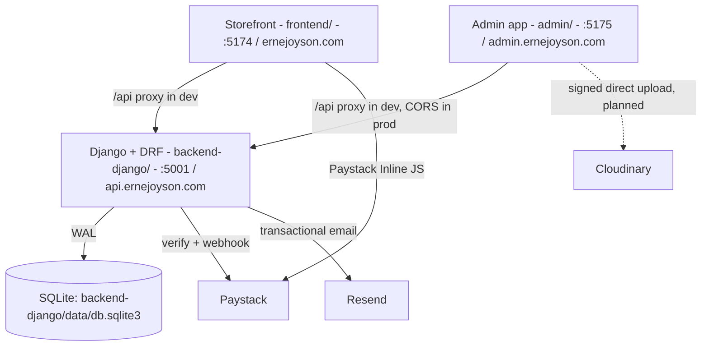

# PROJECT MEMORY & ARCHITECTURAL KNOWLEDGE BASE
**Project Name**: ERNEJOYSON Company Limited (Enterprise E-Commerce & Agricultural Distribution Platform)  
**Last Updated**: October 1, 2026 (Django API port, Docker staging/prod, admin split into its own app)  
**Primary Repository**: `frontend/.git` (`origin/main`). `admin/` and `backend-django/` are **not yet in git**.  
**Workspace Root**: `/Users/eugenedev/Documents/Partners/EnerJoyson`

---

## 1. Executive Summary & Company Profile

**ERNEJOYSON Company Limited** is a premier Ghanaian agro-industrial distributor headquartered in Ghana, supplying veterinary pharmaceuticals, agrochemicals (fungicides, insecticides, herbicides), foliar & granular fertilizers, hybrid seeds, and farm machinery to commercial farmers, plantation managers, and regional agro-dealers across Ghana.

### Primary Distribution Depots & Hubs:
1. **Kumasi Central Depot & Regional HQ**: Adum Agrochemical Corridor, Kumasi, Ashanti Region. (Primary stock & dispatch facility).
2. **Kasoa Administrative & Regional Hub**: Central Region.
3. **Sunyani Distribution Station**: Bono Region.
4. **Techiman Transit Depot**: Bono East Region.
5. **Goaso Cocoa Input Station**: Ahafo Region (Cocoa belt supply).
6. **Agona Swedru & Nsawam Branches**: Central & Eastern Regions.

### Key Executive Leadership & Asset Rules:
- **Managing Director**: Richard. **Rule**: Always use [`frontend/src/assets/staff/Directorr.jpeg`](file:///Users/eugenedev/Documents/Partners/EnerJoyson/frontend/src/assets/staff/Directorr.jpeg) for the Managing Director across all leadership sections.
- **Christopher (Abinga Christopher Kwadwo)**: Uses [`frontend/src/assets/staff/christopher.jpeg`](file:///Users/eugenedev/Documents/Partners/EnerJoyson/frontend/src/assets/staff/christopher.jpeg) on the About Page.

---

## 2. System Architecture & Tech Stack

Three deployables:



| Layer | Technologies | Location / Port |
|---|---|---|
| **Storefront** | React 19, Vite 8, React Router 7, TS, Tailwind 4, Zustand, MapLibre, Paystack inline | `frontend/`, `:5174` |
| **Admin** | Same stack minus maps/Paystack; routes at root (`/login`, `/orders`, ...) | `admin/`, `:5175` |
| **API** | Django 6.1, DRF, SimpleJWT, drf-spectacular (Swagger `/api/docs`), Resend, Paystack, gunicorn, WhiteNoise; managed by `uv` (Python 3.12) | `backend-django/`, `:5001` |
| **Database** | SQLite WAL (Postgres later if needed) | `backend-django/data/` |
| **Deploy** | Docker: one compose per app, env chosen by `--env-file .env.staging|.env.production`; Caddy in front for TLS | see each app's README |
| **Legacy** | Old Node/Express API, kept until Django is confirmed in prod. Do not develop on it. | `backend/` |

---

## 3. Credentials & Core Services

### Admin Portal Credentials (local dev):
- **URL**: `http://localhost:5175/login` (prod: `https://admin.ernejoyson.com`)
- **Email**: `admin@ernejoyson.com`
- **Password**: local dev password is kept out of this repo (it is public). Set real ones per env with `createsuperuser`.
- **Role**: `superadmin`
- **JWT Storage**: `localStorage` keys `ej_admin_token` / `ej_admin_user` on the **admin origin only** (7-day token).

### Integration keys (all unset locally; features degrade gracefully):
- `backend-django/.env`: `PAYSTACK_SECRET_KEY`, `RESEND_API_KEY`, `EMAIL_FROM`, `ADMIN_NOTIFY_EMAILS`, `CLOUDINARY_*`.
- `frontend`: `VITE_PAYSTACK_PUBLIC_KEY` (unset = sandbox fake-pay), `VITE_API_URL` (empty in dev).

### NPM Install Permissions Note (macOS Host):
When installing packages in `frontend/` or `admin/`, always run with `--cache /tmp/.npm-cache` to avoid `EACCES` permission errors on `/Users/eugenedev/.npm`:
```bash
npm install <pkg> --cache /tmp/.npm-cache
```

---

## 4. Database Schema & Data Models

Django models: `apps/accounts` (User, email login), `apps/catalog` (Product), `apps/customers` (Customer), `apps/orders` (Order, OrderItem). Seed with `loaddata products` (+ `legacy_orders`). Field names below are unchanged from the legacy schema.

### Key Tables:
1. `admins`:
   - `id`, `email`, `password_hash`, `name`, `role`, `created_at`, `updated_at`.
2. `products`:
   - `id`, `name`, `category`, `category_slug`, `price`, `price_display`, `ref_code`, `spec`, `notes`, `in_stock` (1/0), `stock_quantity`, `featured`, `image`, `description`.
   - Pre-seeded with **107 real catalog items** from Ghanaian agrochemical & veterinary inventory.
3. `orders`:
   - `id`, `order_number` (e.g. `ENJ-405795`), `customer_name`, `customer_phone`, `customer_email`, `delivery_location`, `branch_id`, `payment_method` (`MOMO`, `BANK_TRANSFER`, `CARD`, `PAY_ON_DELIVERY`), `payment_status` (`PAID`, `PENDING`, `FAILED`), `order_status` (`PENDING`, `CONFIRMED`, `DISPATCHED`, `DELIVERED`, `CANCELLED`), `total_amount`, `notes`, `waybill_number`, `waybill_courier`, `paystack_reference`.
4. `order_items`:
   - `id`, `order_id`, `product_id`, `product_name`, `product_image`, `quantity`, `unit_price`, `total_price`.
5. `customers`:
   - `id`, `name`, `phone`, `email`, `location`, `orders_count`, `total_spent`, `last_order_at`.

---

## 5. End-to-End E-Commerce & Order Workflow

1. **Customer Order Placement**:
   - Customer adds items to cart in storefront.
   - Opens [`frontend/src/components/common/CartDrawer.tsx`](file:///Users/eugenedev/Documents/Partners/EnerJoyson/frontend/src/components/common/CartDrawer.tsx).
   - Checkout sends payload to `POST /api/orders`.
   - The API re-prices every line from the catalog (client prices ignored), verifies the Paystack reference server-side, rejects reused references / unknown / out-of-stock products, upserts the customer, and emails customer + ops via Resend.
   - **Known bug (open)**: `CartDrawer.completeOrder` swallows API errors and still shows a success receipt.
2. **Admin Verification & Fulfillment**:
   - Navigates to `/orders` in the admin app or views the urgent alert banner on the dashboard (`/`).
   - One-click phone dialing (`tel:`) to verify delivery address with the farmer.
   - Status updated to `CONFIRMED`.
3. **Regional Waybill Assignment & Dispatch**:
   - Admin opens the slide-over drawer, inputs Consignment / Waybill number (e.g., `WB-GSO-2026-009`) and courier (e.g., *VIP Express Cargo* or *OA Express*).
   - Backend sets `order_status = 'DISPATCHED'` and emails the customer the waybill.
   - Admin clicks **"Print Cargo Waybill"** to generate physical manifest for vehicle loading.
4. **Product Inventory & Real-Time Stock Control**:
   - In `/products` (admin app), admins can toggle stock between `In Stock` and `Out of Stock` with a single click (`PATCH /api/products/:id/stock`), instantly updating the store.
   - Price and package specifications can be updated inline.

---

## 6. Public Pages & Critical Specifications

### Navigation & Layout Architecture:
- Handled in [`frontend/src/App.tsx`](file:///Users/eugenedev/Documents/Partners/EnerJoyson/frontend/src/App.tsx):
  - `PublicLayout`: Renders Header, Cart Drawer, Cookie Consent, Outlet, and Mega Footer for storefront routes (`/`, `/shop`, `/solutions`, `/technical-support`, `/locations`, `/b2b`, `/knowledge`, `/about`, legal pages).
  - The admin portal is **no longer in this app**. It lives in `admin/` (`admin/src/App.tsx`, `AdminLayout` guards all routes). The storefront `api.ts` only exposes `orders.create`.
- Fixed 3-Pill Header: Links configured to: *Home*, *Shop*, *B2B Wholesales*, and *About*, with live Cart trigger pill and Technical Support shortcut.

### Vaccination Chart Policy:
- **Strict User Mandate**: **Only** the official PDF uploaded by the user ([`ERNEJOYSON VACCINATION CHART.pdf`](file:///Users/eugenedev/Documents/Partners/EnerJoyson/frontend/src/assets/ERNEJOYSON%20VACCINATION%20CHART.pdf)) is to be displayed on the platform.
- **Removed**: The previous synthetic "Ghana standard poultry medication and vaccination schedule" table was removed.
- **Current Implementation**:
  - Embedded responsive PDF viewer `<object data={...} type="application/pdf">` in [`frontend/src/pages/TechnicalSupportPage.tsx`](file:///Users/eugenedev/Documents/Partners/EnerJoyson/frontend/src/pages/TechnicalSupportPage.tsx).
  - Also copied to [`frontend/public/ERNEJOYSON_VACCINATION_CHART.pdf`](file:///Users/eugenedev/Documents/Partners/EnerJoyson/frontend/public/ERNEJOYSON_VACCINATION_CHART.pdf) for direct static URL access.
  - Quick action buttons: **Open in New Tab** and **Download PDF**.
  - Immediate download link also provided upon B2B quote submission in `B2bSection.tsx` and in `KnowledgePage.tsx`.

### Locations Page:
- [`frontend/src/pages/LocationsPage.tsx`](file:///Users/eugenedev/Documents/Partners/EnerJoyson/frontend/src/pages/LocationsPage.tsx):
  - Uses MapLibre GL / MapCN for a clean interactive Ghana map.
  - Displays regional depots with direct contact personnel and phone lines.
  - Designed for farmers: visual, high-contrast, avoiding wall-of-text fatigue.

### Payments Policy:
- Payments and checkout transactions are processed directly on the platform via the Paystack gateway.
- Phone numbers and email addresses displayed across the site are strictly for contact and veterinary advisory purposes, **never** for off-platform offline payment bypass.

### Legal, Privacy & Cookie Governance:
- **Cookie Consent**: [`frontend/src/components/common/CookieConsent.tsx`](file:///Users/eugenedev/Documents/Partners/EnerJoyson/frontend/src/components/common/CookieConsent.tsx) implements Ghana Data Protection Act (Act 843) compliance with granular toggles (Essential Storage always active, Performance/Analytics optional). Saved in `localStorage` under `ej_cookie_consent_v1`.
- **Legal & Privacy Page**: [`frontend/src/pages/LegalPrivacyPage.tsx`](file:///Users/eugenedev/Documents/Partners/EnerJoyson/frontend/src/pages/LegalPrivacyPage.tsx) handles `/privacy`, `/terms`, `/cookies`, `/compliance`, and `/legal` with interactive tabs covering customer data protection, commercial waybill rules, local storage policies, and EPA Ghana agrochemical safety guidelines.
- **Modern Classy Footer**: [`frontend/src/components/sections/Footer.tsx`](file:///Users/eugenedev/Documents/Partners/EnerJoyson/frontend/src/components/sections/Footer.tsx) features company agricultural divisions, farmer services, regional depots, direct contact points, official social media links (WhatsApp, Facebook, TikTok), and a direct "Cookie Settings" trigger.

---

## 7. Useful Operational Commands

```bash
# API (Django) on :5001
cd backend-django && uv run manage.py runserver 5001
uv run manage.py test apps                 # backend tests
uv run manage.py loaddata products         # seed catalog into a fresh DB

# Storefront on :5174 / Admin on :5175 (both proxy /api -> :5001)
cd frontend && npm run dev
cd admin && npm run dev
npm run build                              # in either app: tsc + vite build, must be 0 errors

# Docker (each of backend-django/ and admin/)
docker compose --env-file .env.staging up -d --build
docker compose --env-file .env.production up -d --build

# Git (frontend repo only, for now)
cd frontend && git add -A && git commit -m "msg" && git push origin main
```

---

## 8. Directory Sitemap

```
EnerJoyson/
├── memory.md                    # copy of this file
├── frontend/                    # PUBLIC storefront (git repo)
│   ├── src/pages/               # Home, Shop, ProductDetail, Solutions, TechnicalSupport, Locations, B2b, Knowledge, About, LegalPrivacy
│   ├── src/components/          # common/ (Header, CartDrawer, CookieConsent, GhanaMap), sections/, ui/
│   ├── src/services/api.ts      # storefront API client (orders.create only)
│   ├── src/store/               # useCartStore, useAuthStore (customer), useAppStore
│   └── vite.config.ts           # :5174, /api -> :5001
├── admin/                       # ADMIN app (separate deploy, admin.ernejoyson.com)
│   ├── src/pages/               # AdminLayout, Login, Dashboard, Orders, Products, Customers, Settings
│   ├── src/services/api.ts      # admin API client (VITE_API_URL prefix)
│   ├── src/store/useAdminAuthStore.ts
│   ├── nginx/default.conf.template  # SPA + CSP (connect-src = API origin)
│   └── Dockerfile, compose.yaml, .env.{staging,production}.example
├── backend-django/              # API (Django + DRF)
│   ├── config/                  # settings (env-driven), urls, error envelope, swagger helper
│   ├── apps/                    # accounts, catalog, customers, orders, payments, notifications, uploads, analytics
│   ├── templates/emails/order.html
│   └── Dockerfile, compose.yaml, docker-entrypoint.sh, .env.{staging,production}.example
└── backend/                     # LEGACY Express API (pending deletion)
```
