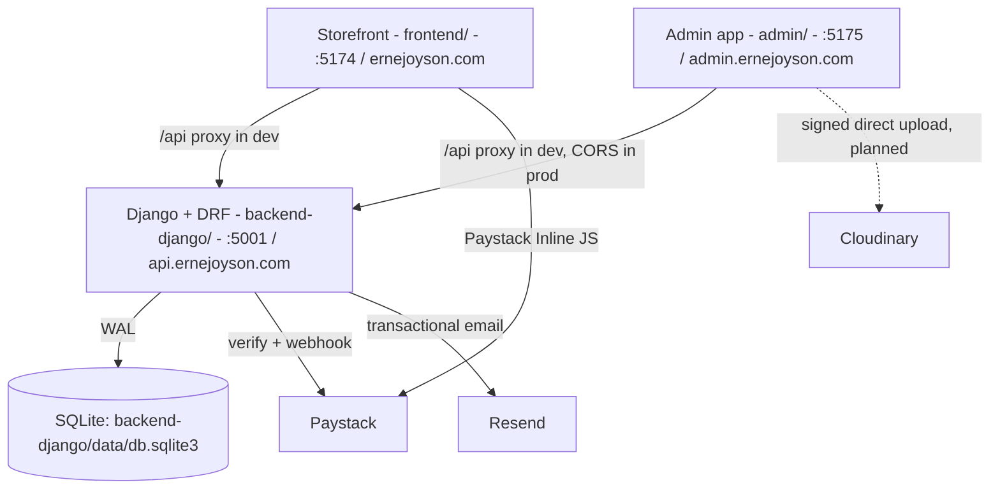

# PROJECT MEMORY & ARCHITECTURAL KNOWLEDGE BASE
**Project Name**: ERNEJOYSON Company Limited (Enterprise E-Commerce & Agricultural Distribution Platform)  
**Last Updated**: October 1, 2026 (Django API port, Docker staging/prod, admin split into its own app)  
**Primary Repository**: `frontend/.git` (`origin/main`). Repos (all `eugene-sew`): `ernejoyson-frontend-` (public), `ernejoyson-admin` (private), `ernejoyson-backend` (private, from `backend-django/`). Legacy `backend/` is not in git.  
**Workspace Root**: `/Users/eugenedev/Documents/Partners/EnerJoyson`

---

## 1. Executive Summary & Company Profile

**ERNEJOYSON Company Limited** is a premier Ghanaian agro-industrial distributor headquartered in Ghana, supplying veterinary pharmaceuticals, agrochemicals (fungicides, insecticides, herbicides), foliar & granular fertilizers, hybrid seeds, and farm machinery to commercial farmers, plantation managers, and regional agro-dealers across Ghana.

### Primary Distribution Depots & Hubs:
1. **Kumasi Central Depot & Regional HQ**: Adum Agrochemical Corridor, Kumasi, Ashanti Region. (Primary stock & dispatch facility).
2. **Kasoa Administrative & Regional Hub**: Central Region.
3. **Sunyani Distribution Station**: Bono Region.
4. **Techiman Transit Depot**: Bono East Region.
5. **Goaso Cocoa Input Station**: Ahafo Region (Cocoa belt supply).
6. **Agona Swedru & Nsawam Branches**: Central & Eastern Regions.

### Key Executive Leadership & Asset Rules:
- **Managing Director**: Richard. **Rule**: Always use [`frontend/src/assets/staff/Directorr.jpeg`](file:///Users/eugenedev/Documents/Partners/EnerJoyson/frontend/src/assets/staff/Directorr.jpeg) for the Managing Director across all leadership sections.
- **Christopher (Abinga Christopher Kwadwo)**: Uses [`frontend/src/assets/staff/christopher.jpeg`](file:///Users/eugenedev/Documents/Partners/EnerJoyson/frontend/src/assets/staff/christopher.jpeg) on the About Page.

---

## 2. System Architecture & Tech Stack

Three deployables:



| Layer | Technologies | Location / Port |
|---|---|---|
| **Storefront** | React 19, Vite 8, React Router 7, TS, Tailwind 4, Zustand, MapLibre, Paystack inline | `frontend/`, `:5174` |
| **Admin** | Same stack minus maps/Paystack; routes at root (`/login`, `/orders`, ...) | `admin/`, `:5175` |
| **API** | Django 6.1, DRF, SimpleJWT, drf-spectacular (Swagger `/api/docs`), Resend, Paystack, gunicorn, WhiteNoise; managed by `uv` (Python 3.12) | `backend-django/`, `:5001` |
| **Database** | SQLite WAL (Postgres later if needed) | `backend-django/data/` |
| **Deploy** | Docker: one compose per app, env chosen by `--env-file .env.staging|.env.production`; Caddy in front for TLS | see each app's README |
| **Legacy** | Old Node/Express API, kept until Django is confirmed in prod. Do not develop on it. | `backend/` |

---

## 3. Credentials & Core Services

### Admin Portal Credentials (local dev):
- **URL**: `http://localhost:5175/login` (prod: `https://admin.ernejoyson.com`)
- **Email**: `admin@ernejoyson.com`
- **Password**: local dev password is kept out of this repo (it is public). Set real ones per env with `createsuperuser`.
- **Role**: `superadmin`
- **JWT Storage**: `localStorage` keys `ej_admin_token` / `ej_admin_user` on the **admin origin only** (7-day token).

### Integration keys (all unset locally; features degrade gracefully):
- `backend-django/.env`: `PAYSTACK_SECRET_KEY`, `RESEND_API_KEY`, `EMAIL_FROM`, `ADMIN_NOTIFY_EMAILS`, `CLOUDINARY_*`.
- `frontend`: `VITE_PAYSTACK_PUBLIC_KEY` (unset = sandbox fake-pay), `VITE_API_URL` (empty in dev).

### NPM Install Permissions Note (macOS Host):
When installing packages in `frontend/` or `admin/`, always run with `--cache /tmp/.npm-cache` to avoid `EACCES` permission errors on `/Users/eugenedev/.npm`:
```bash
npm install <pkg> --cache /tmp/.npm-cache
```

---

## 4. Database Schema & Data Models

Django models: `apps/accounts` (User, email login), `apps/catalog` (Product), `apps/customers` (Customer), `apps/orders` (Order, OrderItem). Seed with `loaddata products` (+ `legacy_orders`). Field names below are unchanged from the legacy schema.

### Key Tables:
1. `admins`:
   - `id`, `email`, `password_hash`, `name`, `role`, `created_at`, `updated_at`.
2. `products`:
   - `id`, `name`, `category`, `category_slug`, `price`, `price_display`, `ref_code`, `spec`, `notes`, `in_stock` (1/0), `stock_quantity`, `featured`, `image`, `description`.
   - Pre-seeded with **107 real catalog items** from Ghanaian agrochemical & veterinary inventory.
3. `orders`:
   - `id`, `order_number` (e.g. `ENJ-405795`), `customer_name`, `customer_phone`, `customer_email`, `delivery_location`, `branch_id`, `payment_method` (`MOMO`, `BANK_TRANSFER`, `CARD`, `PAY_ON_DELIVERY`), `payment_status` (`PAID`, `PENDING`, `FAILED`), `order_status` (`PENDING`, `CONFIRMED`, `DISPATCHED`, `DELIVERED`, `CANCELLED`), `total_amount`, `notes`, `waybill_number`, `waybill_courier`, `paystack_reference`.
4. `order_items`:
   - `id`, `order_id`, `product_id`, `product_name`, `product_image`, `quantity`, `unit_price`, `total_price`.
5. `customers`:
   - `id`, `name`, `phone`, `email`, `location`, `orders_count`, `total_spent`, `last_order_at`.

---

## 5. End-to-End E-Commerce & Order Workflow

1. **Customer Order Placement**:
   - Customer adds items to cart in storefront.
   - Opens [`frontend/src/components/common/CartDrawer.tsx`](file:///Users/eugenedev/Documents/Partners/EnerJoyson/frontend/src/components/common/CartDrawer.tsx).
   - Checkout sends payload to `POST /api/orders`.
   - The API re-prices every line from the catalog (client prices ignored), verifies the Paystack reference server-side, rejects reused references / unknown / out-of-stock products, upserts the customer, and emails customer + ops via Resend.
   - **Known bug (open)**: `CartDrawer.completeOrder` swallows API errors and still shows a success receipt.
2. **Admin Verification & Fulfillment**:
   - Navigates to `/orders` in the admin app or views the urgent alert banner on the dashboard (`/`).
   - One-click phone dialing (`tel:`) to verify delivery address with the farmer.
   - Status updated to `CONFIRMED`.
3. **Regional Waybill Assignment & Dispatch**:
   - Admin opens the slide-over drawer, inputs Consignment / Waybill number (e.g., `WB-GSO-2026-009`) and courier (e.g., *VIP Express Cargo* or *OA Express*).
   - Backend sets `order_status = 'DISPATCHED'` and emails the customer the waybill.
   - Admin clicks **"Print Cargo Waybill"** to generate physical manifest for vehicle loading.
4. **Product Inventory & Real-Time Stock Control**:
   - In `/products` (admin app), admins can toggle stock between `In Stock` and `Out of Stock` with a single click (`PATCH /api/products/:id/stock`), instantly updating the store.
   - Price and package specifications can be updated inline.

---

## 6. Public Pages & Critical Specifications

### Navigation & Layout Architecture:
- Handled in [`frontend/src/App.tsx`](file:///Users/eugenedev/Documents/Partners/EnerJoyson/frontend/src/App.tsx):
  - `PublicLayout`: Renders Header, Cart Drawer, Cookie Consent, Outlet, and Mega Footer for storefront routes (`/`, `/shop`, `/solutions`, `/technical-support`, `/locations`, `/b2b`, `/knowledge`, `/about`, legal pages).
  - The admin portal is **no longer in this app**. It lives in `admin/` (`admin/src/App.tsx`, `AdminLayout` guards all routes). The storefront `api.ts` only exposes `orders.create`.
- Fixed 3-Pill Header: Links configured to: *Home*, *Shop*, *B2B Wholesales*, and *About*, with live Cart trigger pill and Technical Support shortcut.

### Vaccination Chart Policy:
- **Strict User Mandate**: **Only** the official PDF uploaded by the user ([`ERNEJOYSON VACCINATION CHART.pdf`](file:///Users/eugenedev/Documents/Partners/EnerJoyson/frontend/src/assets/ERNEJOYSON%20VACCINATION%20CHART.pdf)) is to be displayed on the platform.
- **Removed**: The previous synthetic "Ghana standard poultry medication and vaccination schedule" table was removed.
- **Current Implementation**:
  - Embedded responsive PDF viewer `<object data={...} type="application/pdf">` in [`frontend/src/pages/TechnicalSupportPage.tsx`](file:///Users/eugenedev/Documents/Partners/EnerJoyson/frontend/src/pages/TechnicalSupportPage.tsx).
  - Also copied to [`frontend/public/ERNEJOYSON_VACCINATION_CHART.pdf`](file:///Users/eugenedev/Documents/Partners/EnerJoyson/frontend/public/ERNEJOYSON_VACCINATION_CHART.pdf) for direct static URL access.
  - Quick action buttons: **Open in New Tab** and **Download PDF**.
  - Immediate download link also provided upon B2B quote submission in `B2bSection.tsx` and in `KnowledgePage.tsx`.

### Locations Page:
- [`frontend/src/pages/LocationsPage.tsx`](file:///Users/eugenedev/Documents/Partners/EnerJoyson/frontend/src/pages/LocationsPage.tsx):
  - Uses MapLibre GL / MapCN for a clean interactive Ghana map.
  - Displays regional depots with direct contact personnel and phone lines.
  - Designed for farmers: visual, high-contrast, avoiding wall-of-text fatigue.

### Payments Policy:
- Payments and checkout transactions are processed directly on the platform via the Paystack gateway.
- Phone numbers and email addresses displayed across the site are strictly for contact and veterinary advisory purposes, **never** for off-platform offline payment bypass.

### Legal, Privacy & Cookie Governance:
- **Cookie Consent**: [`frontend/src/components/common/CookieConsent.tsx`](file:///Users/eugenedev/Documents/Partners/EnerJoyson/frontend/src/components/common/CookieConsent.tsx) implements Ghana Data Protection Act (Act 843) compliance with granular toggles (Essential Storage always active, Performance/Analytics optional). Saved in `localStorage` under `ej_cookie_consent_v1`.
- **Legal & Privacy Page**: [`frontend/src/pages/LegalPrivacyPage.tsx`](file:///Users/eugenedev/Documents/Partners/EnerJoyson/frontend/src/pages/LegalPrivacyPage.tsx) handles `/privacy`, `/terms`, `/cookies`, `/compliance`, and `/legal` with interactive tabs covering customer data protection, commercial waybill rules, local storage policies, and EPA Ghana agrochemical safety guidelines.
- **Modern Classy Footer**: [`frontend/src/components/sections/Footer.tsx`](file:///Users/eugenedev/Documents/Partners/EnerJoyson/frontend/src/components/sections/Footer.tsx) features company agricultural divisions, farmer services, regional depots, direct contact points, official social media links (WhatsApp, Facebook, TikTok), and a direct "Cookie Settings" trigger.

---

## 7. Useful Operational Commands

```bash
# API (Django) on :5001
cd backend-django && uv run manage.py runserver 5001
uv run manage.py test apps                 # backend tests
uv run manage.py loaddata products         # seed catalog into a fresh DB

# Storefront on :5174 / Admin on :5175 (both proxy /api -> :5001)
cd frontend && npm run dev
cd admin && npm run dev
npm run build                              # in either app: tsc + vite build, must be 0 errors

# Docker (each of backend-django/ and admin/)
docker compose --env-file .env.staging up -d --build
docker compose --env-file .env.production up -d --build

# Git: each of frontend/, admin/, backend-django/ is its own repo
cd frontend && git add -A && git commit -m "msg" && git push origin main
```

---

## 8. Directory Sitemap

```
EnerJoyson/
├── memory.md                    # copy of this file
├── frontend/                    # PUBLIC storefront (git repo)
│   ├── src/pages/               # Home, Shop, ProductDetail, Solutions, TechnicalSupport, Locations, B2b, Knowledge, About, LegalPrivacy
│   ├── src/components/          # common/ (Header, CartDrawer, CookieConsent, GhanaMap), sections/, ui/
│   ├── src/services/api.ts      # storefront API client (orders.create only)
│   ├── src/store/               # useCartStore, useAuthStore (customer), useAppStore
│   └── vite.config.ts           # :5174, /api -> :5001
├── admin/                       # ADMIN app (separate deploy, admin.ernejoyson.com)
│   ├── src/pages/               # AdminLayout, Login, Dashboard, Orders, Products, Customers, Settings
│   ├── src/services/api.ts      # admin API client (VITE_API_URL prefix)
│   ├── src/store/useAdminAuthStore.ts
│   ├── nginx/default.conf.template  # SPA + CSP (connect-src = API origin)
│   └── Dockerfile, compose.yaml, .env.{staging,production}.example
├── backend-django/              # API (Django + DRF)
│   ├── config/                  # settings (env-driven), urls, error envelope, swagger helper
│   ├── apps/                    # accounts, catalog, customers, orders, payments, notifications, uploads, analytics
│   ├── templates/emails/order.html
│   └── Dockerfile, compose.yaml, docker-entrypoint.sh, .env.{staging,production}.example
└── backend/                     # LEGACY Express API (pending deletion)
```

---

## 9. Recent Product Catalog & Assets Updates

### Product Catalog Images (`frontend/public/products/`)
- Authentic photography sourced from `frontend/src/Ernejoyson Limited Products/` (159 total original images).
- Copied directly into `frontend/public/products/` and referenced cleanly via `/products/<filename>`.
- **Mapping Strategy**:
  - **106 of 107 products** successfully mapped to authentic photography.
  - **90 items** mapped directly via the 4-digit code in their product ID (e.g., `fdr-8066` -> `/products/IMG_8066.jpg`).
  - **16 items** mapped via visual and OCR validation (feeders with stands, gas brooders, pluckers, multi-dose continuous syringes, Bolai Penstrep, Patholyte 5L, Bolai Amitraz, Bolai Polypeptide Fatten Prime, Livertonic, etc.).
  - **1 item** (`eq-grain-crush` - Grain Crushing Machine) retains its fallback machinery photo as it is heavy industrial equipment without an in-store bottle/box photo.
- **Synchronized across 3 data sources**:
  1. `frontend/src/data/products.ts` (Storefront static data)
  2. `backend-django/apps/catalog/fixtures/products.json` (Django catalog fixtures)
  3. `backend-django/data/db.sqlite3` (`catalog_product` table in SQLite)

### Technical Support Vaccination Chart
- Exclusively displays the official `ERNEJOYSON VACCINATION CHART.pdf` via an interactive canvas / PDF viewer with download and zoom controls. All unrelated generic schedules removed.

### Footer & Brand Assets
- Social icons: TikTok (`https://www.tiktok.com/@ernejoyson`) and WhatsApp only. Removed LinkedIn, X, and Instagram.
- Cookie preference manager & Legal/Privacy/Terms page (`LegalPrivacyPage.tsx`).
- Christopher's team picture updated to `christopher.jpeg` on the About page.

### Vercel Deployment & SPA Routing
- Created `frontend/vercel.json` and `admin/vercel.json` with standard SPA rewrites (`"source": "/(.*)", "destination": "/index.html"`), clean URLs, asset caching (`/assets/*`, `/products/*`), and security headers. Resolves the Vercel `404 NOT_FOUND` on deep links/page reloads.

---

## 10. Work Log & Decisions (Oct 1, 2026)

1. **Backend ported to Django** (`backend-django/`, repo `ernejoyson-backend`): same URLs and `{success, ...}` envelopes as Express, so neither frontend needed API changes. The server now prices orders from the DB, verifies Paystack server-side (amount + GHS + one order per reference), takes a signed webhook (`/api/payments/paystack/webhook`), sends Resend emails after commit (failures never break checkout), and signs Cloudinary uploads (`POST /api/uploads/cloudinary/signature`). 12 tests: `uv run manage.py test apps`.
2. **Docker staging/production** for the API and admin. `--env-file` picks the environment; each environment gets its own container and DB volume. Staging uses Paystack test keys, has docs on and tags emails `[STAGING]`; production has docs off and HSTS on. HTTPS redirects need `X-Forwarded-Proto` from the proxy.
3. **Admin split** into `admin/` (repo `ernejoyson-admin`, private). Routes moved from `/admin/*` to the root. The guard renders `<Navigate>` (calling `navigate()` during render caused a white screen) and validates the stored token on load. Storefront `/admin` now shows the homepage.
4. **End-to-end verified** through the Vite proxy (26 API checks) and with headless Chromium on the admin (12 checks). Playwright is not a project dependency; it was installed in a scratch dir.
5. **Storefront catalog is live (Oct 6)**: `frontend/src/store/useCatalogStore.ts` renders bundled `PRODUCTS` instantly, then swaps in `GET /api/products`, so admin stock and price edits reach the shop. If the API is down, the bundled list stays. Shop and ProductDetail use `useCatalog()`. Browser-verified: a stock or price change in the admin shows on the product page, and all 106 admin thumbnails load.
6. **Admin redesigned as store dashboard + CMS (Oct 6)**: light brand theme matching storefront/login (tokens in `admin/src/index.css` `@theme`). Pages: Dashboard (real data only, no sample fallback; 30-day revenue chart), Orders (status tabs, drawer with confirm → dispatch → deliver, waybill print), Products (filters, inline on-sale/featured toggles), Product editor (`/products/new`, `/products/:id`, live storefront preview, Cloudinary upload when keys are set), Customers (drawer with order history), Settings (real integration status via `GET /api/system/status`). API added `GET`/`DELETE /api/products/:id`, `revenueByDay`/`topProducts`/`lowStockProducts` in the summary, and `image` accepts storefront paths. Browser-verified end to end.
7. **Roles, sign-off, audit, integrations, pagination (Oct 6)**: 7 roles from the corporate profile (owner, finance, board, branch_manager, sales, logistics, digital) in `backend-django/apps/accounts/roles.py`; branch-scoped roles see only their branch. Order sign-off chain with who/when trail; paid orders still need sign-off. Team page (owners create staff; one-time temp password; forced change). Append-only audit log of every actor; Activity page shows staff only. Owners enter Paystack/Resend/Cloudinary keys in Settings (encrypted, masked, testable; `.env` fallback). Every admin table paginated server-side. **Official branches are only Kasoa (HQ), Kumasi, Swedru, Nsawam** (Sunyani/Techiman/Goaso were wrong). Browser-verified with owner/sales/manager/logistics accounts; backend 30 tests.
8. **Auth flows, email design, null states (Oct 6)**: forgot/reset password (`/forgot-password`, `/reset-password?token=`), staff invites by email, session revocation on password change (JWT `pv` claim), designed emails (`backend-django/templates/emails/`), null states across the admin (setup checklist for owners, not-found states, 404 page). Resend is live for local dev: key in `backend-django/.env` (git-ignored), sender `ernejoyson@ballotbase.site` (domain verified). Test emails go to `delivered+…@resend.dev` only. One stray test invite was sent to `witty@ernejoyson.com` on Oct 6 before tests were isolated. The login page's dev credentials now only appear in `import.meta.env.DEV` builds.
9. **Catalog CMS (Oct 7)**: soft delete only (Deleted tab + restore + Undo toasts), batch actions with select-all-matching, xlsx/csv import with per-row preview (all-or-nothing) and export/template, server-side image upload when Cloudinary isn't connected (WebP, EXIF stripped, stored in `backend-django/data/media`). Batch category moves also update a default card label. Browser-verified (22 checks), 43 backend tests.
10. **Oct 7 round**: soft delete is record keeping only (no Deleted tab / restore / undo). One `ImageDropzone` for every image field (drag & drop, paste, image fills the frame). Payment gateway log (Activity → Payments). Activity description is just "System audit logs." Customers filter/sort. **Categories are managed** (Products → Categories; storefront reads `/api/categories`). Product price/featured/image filters + sort. Orders refresh shows spinner, progress bar, "Updated …" stamp. **Branches are managed** in Settings by owners (region of 16, town, district, GhanaPost GPS, map pin via lazy MapLibre). Environment/Swagger card is owner-only. Staff sign-in history in the Team drawer. Backend 51 tests.
11. **Frontend hosting moved to Vercel** (`vercel.json` in `frontend/` and `admin/`). The API stays on Docker behind Caddy/Nginx.

### Open Issues (priority order)
1. **Checkout false success**: `CartDrawer.completeOrder` catches API errors and still shows a receipt. With live Paystack keys a customer can be charged with no order. Fix: validate the cart with the API before opening Paystack and surface save errors.
2. ~~Admin product images broken~~ **Fixed Oct 6**: `admin/src/lib/storefront.ts` prefixes storefront-relative images with `VITE_STOREFRONT_URL` (dev default `http://localhost:5174`). Note: `Product.image` is a `URLField`, so sending a relative image path through the API still fails validation.
3. **Admin CSP missing on Vercel**: `admin/vercel.json` lacks the `Content-Security-Policy` that `admin/nginx/default.conf.template` sets. Add it with `connect-src 'self' https://api.ernejoyson.com` (staging: staging-api).
4. **Leaked local admin password**: the original local dev password is in the public `ernejoyson-frontend-` history (commit 549e016). Never use it for staging or prod. Rewriting history needs a force-push, so only do it if the owner asks.
4d. **Storefront doesn't read the admin-saved Paystack public key yet**: `GET /api/public/config` exists; CartDrawer still uses `VITE_PAYSTACK_PUBLIC_KEY`.
4c. **`featured` flag unused by storefront**: the admin can set it, but the homepage "Featured products" section is a hardcoded list. Wire it to `useCatalog().filter(p => p.featured)` if wanted.
4b. ~~Admin login page shows demo credentials~~ **Fixed Oct 6**: shown/pre-filled only in dev builds (verified absent from the production bundle).
4e. **Stale storefront copy**: cookie banner mentions "Sunyani, Goaso" depots (not branches); storefront Locations page still has its own hardcoded branch data (could read `GET /api/branches`).
5. **Stale legal copy**: `LegalPrivacyPage.tsx` says cookies keep "admin login sessions" on the storefront. That is no longer true.
6. **Not built yet**: Cloudinary upload UI in the admin (also add `https://api.cloudinary.com` to the admin CSP), per-depot staff roles, Paystack initialize endpoint, Postgres, background email queue, backups cron.
7. **Legacy `backend/`** (Express) can be deleted once Django is live.

### Local dev gotcha
Background dev servers started by Claude are killed after a 2-hour maximum. Run long-lived servers in your own terminal.
