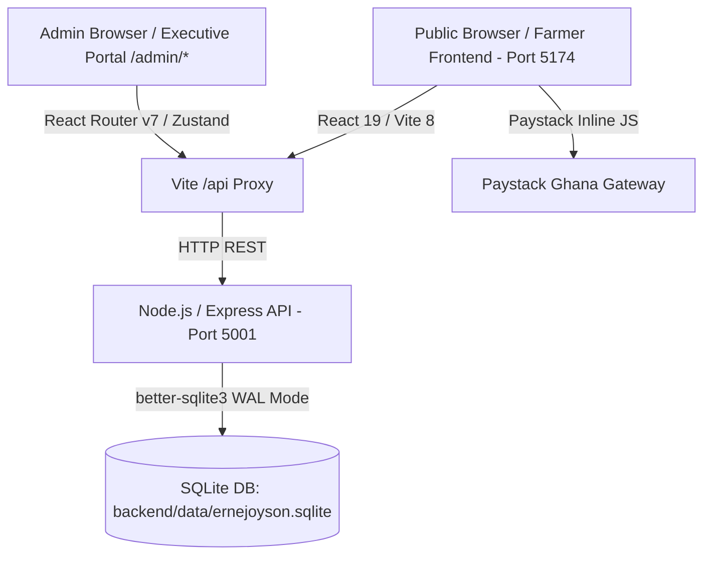

# PROJECT MEMORY & ARCHITECTURAL KNOWLEDGE BASE
**Project Name**: ERNEJOYSON Company Limited (Enterprise E-Commerce & Agricultural Distribution Platform)  
**Last Updated**: October 1, 2026  
**Primary Repository**: `frontend/.git` (`origin/main`)  
**Workspace Root**: `/Users/eugenedev/Documents/Partners/EnerJoyson`

---

## 1. Executive Summary & Company Profile

**ERNEJOYSON Company Limited** is a premier Ghanaian agro-industrial distributor headquartered in Ghana, supplying veterinary pharmaceuticals, agrochemicals (fungicides, insecticides, herbicides), foliar & granular fertilizers, hybrid seeds, and farm machinery to commercial farmers, plantation managers, and regional agro-dealers across Ghana.

### Primary Distribution Depots & Hubs:
1. **Kumasi Central Depot & Regional HQ**: Adum Agrochemical Corridor, Kumasi, Ashanti Region. (Primary stock & dispatch facility).
2. **Kasoa Administrative & Regional Hub**: Central Region.
3. **Sunyani Distribution Station**: Bono Region.
4. **Techiman Transit Depot**: Bono East Region.
5. **Goaso Cocoa Input Station**: Ahafo Region (Cocoa belt supply).
6. **Agona Swedru & Nsawam Branches**: Central & Eastern Regions.

### Key Executive Leadership & Asset Rules:
- **Managing Director**: Richard. **Rule**: Always use [`frontend/src/assets/staff/Directorr.jpeg`](file:///Users/eugenedev/Documents/Partners/EnerJoyson/frontend/src/assets/staff/Directorr.jpeg) for the Managing Director across all leadership sections.
- **Christopher (Abinga Christopher Kwadwo)**: Uses [`frontend/src/assets/staff/christopher.jpeg`](file:///Users/eugenedev/Documents/Partners/EnerJoyson/frontend/src/assets/staff/christopher.jpeg) on the About Page.

---

## 2. System Architecture & Tech Stack



### Technology Matrix:
| Layer | Technologies & Libraries | Ports / Locations |
|---|---|---|
| **Frontend** | React 19, Vite 8, React Router v7, TypeScript, Tailwind CSS v4, Lucide React, Zustand 5, MapLibre GL | Port `5174` (`frontend/`) |
| **Backend API** | Node.js, Express, TypeScript, Zod, JWT (`jsonwebtoken`), `bcryptjs`, `cors`, `dotenv` | Port `5001` (`backend/`) |
| **Database** | SQLite via `better-sqlite3` running in **WAL mode** | `backend/data/ernejoyson.sqlite` |
| **Payment Gateway** | Paystack Ghana Gateway (`@paystack/inline-js`) for MoMo & Cards | Client-side integration |
| **Source Control** | Git (`main` branch) | `frontend/.git` pushing to `origin` |

---

## 3. Credentials & Core Services

### Admin Portal Credentials:
- **URL**: `http://localhost:5174/admin/login`
- **Email**: `admin@ernejoyson.com`
- **Password**: `Ernejoyson@2026!`
- **Role**: `superadmin`
- **JWT Storage**: `localStorage.getItem('ej_admin_token')` & `localStorage.getItem('ej_admin_user')`

### NPM Install Permissions Note (macOS Host):
When installing packages in `backend/` or `frontend/`, always run with `--cache /tmp/.npm-cache` to avoid `EACCES` permission errors on `/Users/eugenedev/.npm`:
```bash
npm install <pkg> --cache /tmp/.npm-cache
```

---

## 4. Database Schema & Data Models

Database schema is located at [`backend/src/db/schema.sql`](file:///Users/eugenedev/Documents/Partners/EnerJoyson/backend/src/db/schema.sql).

### Key Tables:
1. `admins`:
   - `id`, `email`, `password_hash`, `name`, `role`, `created_at`, `updated_at`.
2. `products`:
   - `id`, `name`, `category`, `category_slug`, `price`, `price_display`, `ref_code`, `spec`, `notes`, `in_stock` (1/0), `stock_quantity`, `featured`, `image`, `description`.
   - Pre-seeded with **107 real catalog items** from Ghanaian agrochemical & veterinary inventory.
3. `orders`:
   - `id`, `order_number` (e.g. `ENJ-405795`), `customer_name`, `customer_phone`, `customer_email`, `delivery_location`, `branch_id`, `payment_method` (`MOMO`, `BANK_TRANSFER`, `CARD`, `PAY_ON_DELIVERY`), `payment_status` (`PAID`, `PENDING`, `FAILED`), `order_status` (`PENDING`, `CONFIRMED`, `DISPATCHED`, `DELIVERED`, `CANCELLED`), `total_amount`, `notes`, `waybill_number`, `waybill_courier`, `paystack_reference`.
4. `order_items`:
   - `id`, `order_id`, `product_id`, `product_name`, `product_image`, `quantity`, `unit_price`, `total_price`.
5. `customers`:
   - `id`, `name`, `phone`, `email`, `location`, `orders_count`, `total_spent`, `last_order_at`.

---

## 5. End-to-End E-Commerce & Order Workflow

1. **Customer Order Placement**:
   - Customer adds items to cart in storefront.
   - Opens [`frontend/src/components/common/CartDrawer.tsx`](file:///Users/eugenedev/Documents/Partners/EnerJoyson/frontend/src/components/common/CartDrawer.tsx).
   - Checkout sends payload to `POST /api/orders`.
   - The backend creates the order, inserts line items, and updates/upserts the customer record in SQLite.
2. **Admin Verification & Fulfillment**:
   - Navigates to `/admin/orders` or views urgent alert banner on `/admin`.
   - One-click phone dialing (`tel:`) to verify delivery address with the farmer.
   - Status updated to `CONFIRMED`.
3. **Regional Waybill Assignment & Dispatch**:
   - Admin opens the slide-over drawer, inputs Consignment / Waybill number (e.g., `WB-GSO-2026-009`) and courier (e.g., *VIP Express Cargo* or *OA Express*).
   - Backend sets `order_status = 'DISPATCHED'`.
   - Admin clicks **"Print Cargo Waybill"** to generate physical manifest for vehicle loading.
4. **Product Inventory & Real-Time Stock Control**:
   - In `/admin/products`, admins can toggle stock between `In Stock` and `Out of Stock` with a single click (`PATCH /api/products/:id/stock`), instantly updating the store.
   - Price and package specifications can be updated inline.

---

## 6. Public Pages & Critical Specifications

### Navigation & Layout Architecture:
- Handled in [`frontend/src/App.tsx`](file:///Users/eugenedev/Documents/Partners/EnerJoyson/frontend/src/App.tsx):
  - `PublicLayout`: Renders Header, Cart Drawer, Outlet, and Mega Footer for storefront routes (`/`, `/shop`, `/solutions`, `/technical-support`, `/locations`, `/b2b`, `/knowledge`, `/about`).
  - `AdminLayout`: Protected dashboard wrapper for `/admin/*` routes. Completely isolates Admin from storefront navigation.
- Fixed 3-Pill Header: Links configured to: *Home*, *Shop*, *B2B Wholesales*, and *About*, with live Cart trigger pill and Technical Support shortcut.

### Vaccination Chart Policy:
- **Strict User Mandate**: **Only** the official PDF uploaded by the user ([`ERNEJOYSON VACCINATION CHART.pdf`](file:///Users/eugenedev/Documents/Partners/EnerJoyson/frontend/src/assets/ERNEJOYSON%20VACCINATION%20CHART.pdf)) is to be displayed on the platform.
- **Removed**: The previous synthetic "Ghana standard poultry medication and vaccination schedule" table was removed.
- **Current Implementation**:
  - Embedded responsive PDF viewer `<object data={...} type="application/pdf">` in [`frontend/src/pages/TechnicalSupportPage.tsx`](file:///Users/eugenedev/Documents/Partners/EnerJoyson/frontend/src/pages/TechnicalSupportPage.tsx).
  - Also copied to [`frontend/public/ERNEJOYSON_VACCINATION_CHART.pdf`](file:///Users/eugenedev/Documents/Partners/EnerJoyson/frontend/public/ERNEJOYSON_VACCINATION_CHART.pdf) for direct static URL access.
  - Quick action buttons: **Open in New Tab** and **Download PDF**.
  - Immediate download link also provided upon B2B quote submission in `B2bSection.tsx` and in `KnowledgePage.tsx`.

### Locations Page:
- [`frontend/src/pages/LocationsPage.tsx`](file:///Users/eugenedev/Documents/Partners/EnerJoyson/frontend/src/pages/LocationsPage.tsx):
  - Uses MapLibre GL / MapCN for a clean interactive Ghana map.
  - Displays regional depots with direct contact personnel and phone lines.
  - Designed for farmers: visual, high-contrast, avoiding wall-of-text fatigue.

### Payments Policy:
- Payments and checkout transactions are processed directly on the platform via the Paystack gateway.
- Phone numbers and email addresses displayed across the site are strictly for contact and veterinary advisory purposes, **never** for off-platform offline payment bypass.

### Legal, Privacy & Cookie Governance:
- **Cookie Consent**: [`frontend/src/components/common/CookieConsent.tsx`](file:///Users/eugenedev/Documents/Partners/EnerJoyson/frontend/src/components/common/CookieConsent.tsx) implements Ghana Data Protection Act (Act 843) compliance with granular toggles (Essential Storage always active, Performance/Analytics optional). Saved in `localStorage` under `ej_cookie_consent_v1`.
- **Legal & Privacy Page**: [`frontend/src/pages/LegalPrivacyPage.tsx`](file:///Users/eugenedev/Documents/Partners/EnerJoyson/frontend/src/pages/LegalPrivacyPage.tsx) handles `/privacy`, `/terms`, `/cookies`, `/compliance`, and `/legal` with interactive tabs covering customer data protection, commercial waybill rules, local storage policies, and EPA Ghana agrochemical safety guidelines.
- **Modern Classy Footer**: [`frontend/src/components/sections/Footer.tsx`](file:///Users/eugenedev/Documents/Partners/EnerJoyson/frontend/src/components/sections/Footer.tsx) features company agricultural divisions, farmer services, regional depots, direct contact points, official social media links (WhatsApp, Facebook, TikTok), and a direct "Cookie Settings" trigger.

---

## 7. Useful Operational Commands

### Start Backend API:
```bash
cd /Users/eugenedev/Documents/Partners/EnerJoyson/backend
npm run dev
# Listens on http://localhost:5001
```

### Start Frontend Dev Server:
```bash
cd /Users/eugenedev/Documents/Partners/EnerJoyson/frontend
npm run dev
# Listens on http://localhost:5174
```

### Build & Typecheck Frontend:
```bash
cd /Users/eugenedev/Documents/Partners/EnerJoyson/frontend
npm run build
# Must output 0 errors
```

### Database Seeding / Reset:
```bash
cd /Users/eugenedev/Documents/Partners/EnerJoyson/backend
npm run seed
# Runs backend/src/db/seed.ts against SQLite DB
```

### Commit & Push Git Changes:
```bash
cd /Users/eugenedev/Documents/Partners/EnerJoyson/frontend
git add -A
git commit -m "your message"
git push origin main
```

---

## 8. Directory Sitemap

```
/Users/eugenedev/Documents/Partners/EnerJoyson/
├── memory.md                           # This persistent memory file
├── backend/
│   ├── data/
│   │   └── ernejoyson.sqlite          # SQLite WAL database
│   ├── src/
│   │   ├── controllers/               # auth, orders, products, customers, analytics
│   │   ├── db/
│   │   │   ├── index.ts               # SQLite connection (WAL mode)
│   │   │   ├── schema.sql             # DB Schema definitions
│   │   │   └── seed.ts                # Seeder for 107 products & admin
│   │   ├── middleware/                # auth.ts (JWT verification)
│   │   ├── routes/                    # API route definitions
│   │   └── index.ts                   # Express server entry point
│   ├── package.json
│   └── tsconfig.json
└── frontend/
    ├── public/
    │   └── ERNEJOYSON_VACCINATION_CHART.pdf
    ├── src/
    │   ├── assets/
    │   │   ├── ERNEJOYSON VACCINATION CHART.pdf
    │   │   └── staff/
    │   │       └── Directorr.jpeg     # Managing Director Richard's photo
    │   ├── components/
    │   │   ├── common/                # Header, CartDrawer
    │   │   └── sections/              # Footer, Hero, B2B, Maps
    │   ├── data/
    │   │   └── products.ts            # 107 Catalog items
    │   ├── pages/
    │   │   ├── admin/                 # AdminLayout, Login, Dashboard, Orders, Products, Customers, Settings
    │   │   ├── HomePage.tsx
    │   │   ├── ShopPage.tsx
    │   │   ├── ProductDetailPage.tsx
    │   │   ├── SolutionsPage.tsx
    │   │   ├── TechnicalSupportPage.tsx # Vaccination Chart PDF Viewer
    │   │   ├── LocationsPage.tsx       # Ghana MapCN depot map
    │   │   ├── B2bPage.tsx
    │   │   ├── KnowledgePage.tsx
    │   │   └── AboutPage.tsx
    │   ├── services/
    │   │   └── api.ts                 # Type-safe API client for backend
    │   ├── store/
    │   │   ├── useAdminAuthStore.ts   # Zustand admin authentication
    │   │   ├── useAuthStore.ts        # Customer state
    │   │   └── useCartStore.ts        # Shopping cart state
    │   ├── App.tsx                    # Route definitions (Public + Admin)
    │   └── vite.config.ts             # Proxy config (/api -> :5001)
    └── package.json
```
